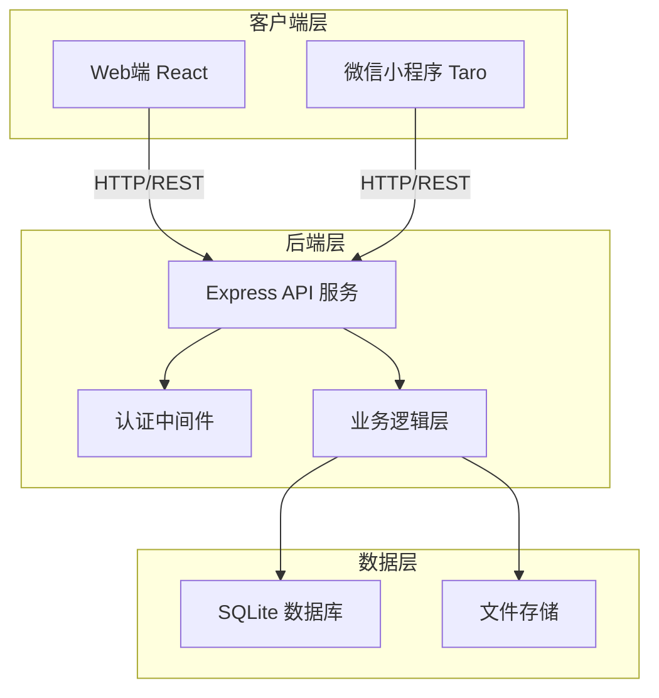
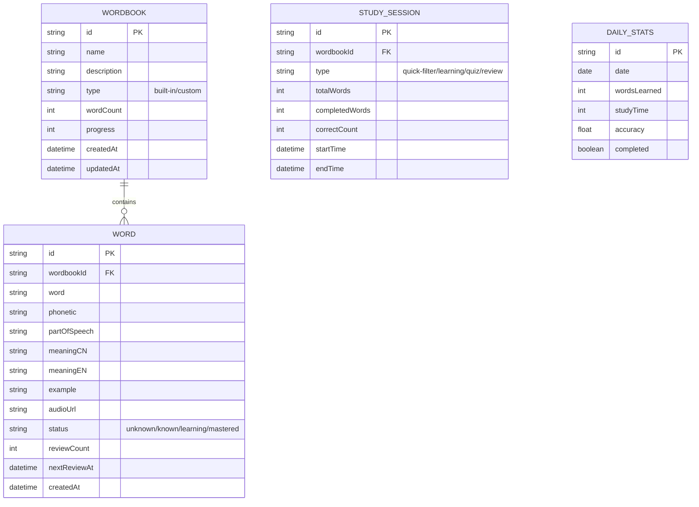

# 左右英语 - 技术架构文档

## 1. Architecture Design



## 2. Technology Description

- **前端框架（Web）**：React@18 + TypeScript
- **前端框架（小程序）**：Taro 3.x + React
- **构建工具**：Vite
- **样式**：Tailwind CSS@3
- **状态管理**：Zustand
- **路由**：React Router DOM（Web）/ Taro Router（小程序）
- **后端**：Express@4 + TypeScript
- **数据库**：SQLite3
- **图标库**：Lucide React
- **手势库**：react-swipeable
- **音频**：Web Audio API

## 3. Route Definitions

| Route | Purpose |
|-------|---------|
| / | 首页 - 词书列表和统计 |
| /wordbook | 词书管理页 |
| /wordbook/:id | 词书详情页 |
| /study/:id | 背诵页面 |
| /stats | 统计页面 |
| /settings | 设置页面 |

## 4. Data Model

### 4.1 Data Model Definition



### 4.2 TypeScript Interfaces

```typescript
// 词书类型
interface WordBook {
  id: string;
  name: string;
  description: string;
  type: 'built-in' | 'custom';
  wordCount: number;
  progress: number;
  createdAt: Date;
  updatedAt: Date;
}

// 单词类型
interface Word {
  id: string;
  wordbookId: string;
  word: string;
  phonetic?: string;
  partOfSpeech?: string;
  meaningCN?: string;
  meaningEN?: string;
  example?: string;
  audioUrl?: string;
  status: 'unknown' | 'known' | 'learning' | 'mastered';
  reviewCount: number;
  nextReviewAt?: Date;
  createdAt: Date;
}

// 学习会话类型
interface StudySession {
  id: string;
  wordbookId: string;
  type: 'quick-filter' | 'learning' | 'quiz' | 'review';
  totalWords: number;
  completedWords: number;
  correctCount: number;
  startTime: Date;
  endTime?: Date;
}

// 每日统计类型
interface DailyStats {
  id: string;
  date: string;
  wordsLearned: number;
  studyTime: number;
  accuracy: number;
  completed: boolean;
}
```

## 5. Project Structure

```
zuoyouyingyu/
├── client/                  # Web 前端
│   ├── src/
│   │   ├── components/      # 可复用组件
│   │   ├── pages/           # 页面组件
│   │   ├── hooks/           # 自定义 hooks
│   │   ├── store/           # Zustand store
│   │   ├── utils/           # 工具函数
│   │   ├── api/             # API 调用
│   │   ├── App.tsx
│   │   └── main.tsx
│   ├── package.json
│   └── ...
├── server/                  # Express 后端
│   ├── src/
│   │   ├── routes/          # API 路由
│   │   ├── controllers/     # 控制器
│   │   ├── models/          # 数据模型
│   │   ├── middleware/      # 中间件
│   │   ├── db/              # 数据库配置
│   │   └── index.ts
│   ├── package.json
│   └── ...
├── shared/                  # 共享类型定义
│   └── types.ts
├── package.json             # 根 package.json
└── README.md
```

## 6. API Route Definitions

| Method | Path | Purpose |
|--------|------|---------|
| GET | /api/wordbooks | 获取所有词书 |
| POST | /api/wordbooks | 创建新词书 |
| GET | /api/wordbooks/:id | 获取单个词书详情 |
| PUT | /api/wordbooks/:id | 更新词书 |
| DELETE | /api/wordbooks/:id | 删除词书 |
| GET | /api/wordbooks/:id/words | 获取词书单词 |
| POST | /api/wordbooks/:id/words | 添加单词到词书 |
| PUT | /api/words/:id | 更新单词 |
| POST | /api/study/sessions | 创建学习会话 |
| PUT | /api/study/sessions/:id | 更新学习会话 |
| GET | /api/stats/daily | 获取每日统计 |
| POST | /api/stats/daily | 更新每日统计 |

## 7. Core Implementation Plan

1. **初始化项目**：使用 vite-init 创建 React + Express 项目
2. **配置环境**：安装依赖，配置 Tailwind CSS
3. **搭建后端**：创建 Express 服务和 SQLite 数据库
4. **实现 API**：创建词书、单词、学习相关的 API
5. **前端基础**：配置 React 路由和 Zustand store
6. **基础组件**：实现卡片、导航等组件
7. **页面开发**：按优先级实现首页、背诵页、词书管理页
8. **手势交互**：实现卡片滑动功能
9. **文件导入**：实现 TXT/Word/PDF 解析
10. **音频功能**：集成发音功能
11. **数据统计**：实现统计图表
12. **后续优化**：考虑迁移到 Taro 框架支持小程序
