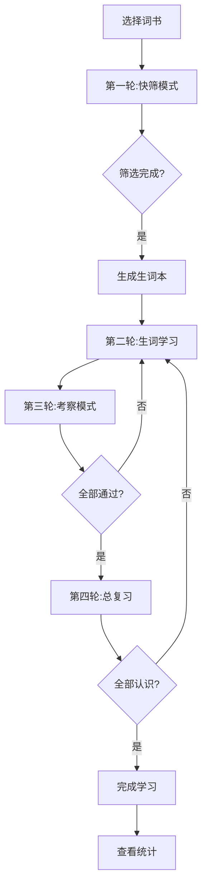

# 左右英语 - 产品需求文档

## 1. Product Overview

左右英语是一款基于"卡片滑动快筛法"的高效背单词工具，支持Web端、微信小程序和安卓APP。用户通过左右滑动卡片快速筛选认识和不认识的单词，结合多轮学习循环，显著提升记忆效率。

- **主要目的**：解决传统背单词效率低、记忆不牢固的问题
- **目标用户**：学生、职场人士、英语爱好者
- **市场价值**：提供高效、简洁、专注的背单词体验，支持自定义词书导入

## 2. Core Features

### 2.1 User Roles
| Role | Registration Method | Core Permissions |
|------|---------------------|------------------|
| Normal User | Local (无需登录) | 使用所有基础功能，本地存储数据 |
| Registered User | 微信/手机号登录 | 基础功能 + 云端数据同步 |

### 2.2 Feature Module
1. **首页**：词书列表展示、学习数据统计
2. **词书管理页**：内置词书选择、自定义词书导入/编辑
3. **背诵页面**：卡片滑动快筛、生词学习、考察、复习
4. **统计页面**：学习数据可视化、学习日历
5. **设置页面**：发音选择、学习计划配置

### 2.3 Page Details
| Page Name | Module Name | Feature description |
|-----------|-------------|---------------------|
| 首页 | 词书列表 | 展示所有词书，显示学习进度 |
| 首页 | 数据统计 | 今日学习时长、单词数、正确率 |
| 词书管理页 | 内置词书 | 预设主流词书，按学段分类 |
| 词书管理页 | 自定义导入 | 支持TXT/Word/PDF导入，格式自动识别 |
| 背诵页面 | 快筛模式 | 卡片滑动，左滑认识，右滑不认识 |
| 背诵页面 | 生词学习 | 显示详细释义、发音、例句 |
| 背诵页面 | 考察模式 | 再次筛选当日学习单词 |
| 统计页面 | 学习日历 | 每日打卡记录 |
| 统计页面 | 掌握度统计 | 已掌握、学习中、未掌握 |

## 3. Core Process

### 用户主流程
1. 用户选择或导入词书
2. 进入第一轮：快筛模式，通过左右滑动筛选生词
3. 进入第二轮：生词学习，按每日计划学习
4. 进入第三轮：考察模式，再次筛选
5. 进入第四轮：总复习，确认所有单词掌握
6. 查看学习统计数据

## 4. User Interface Design

### 4.1 Design Style
- **主色调**：蓝色系（#2563eb, #3b82f6, #60a5fa）
- **次要颜色**：绿色（#10b981，认识）、红色（#ef4444，不认识）
- **按钮风格**：圆角8px，轻微阴影，悬停效果
- **字体**：英文使用 Inter，中文使用 PingFang SC
- **布局风格**：卡片式设计，简洁清爽
- **图标风格**：Lucide React，线性图标

### 4.2 Page Design Overview
| Page Name | Module Name | UI Elements |
|-----------|-------------|-------------|
| 首页 | Hero区域 | 蓝色渐变背景，大标题，统计卡片 |
| 首页 | 词书列表 | 卡片网格，显示封面、名称、进度 |
| 背诵页面 | 单词卡片 | 圆角16px，轻微阴影，居中显示 |
| 背诵页面 | 滑动指示 | 左右滑动时显示边框和提示文字 |
| 统计页面 | 数据图表 | 简洁的柱状图和折线图 |

### 4.3 Responsiveness
- Desktop-first，同时适配平板和移动端
- 移动端优化触摸手势
- 响应式断点：sm(640px), md(768px), lg(1024px)

### 4.4 交互设计
- 卡片滑动距离超过30%触发操作
- 键盘快捷键支持（左/右箭头）
- 所有操作有明确的视觉反馈
